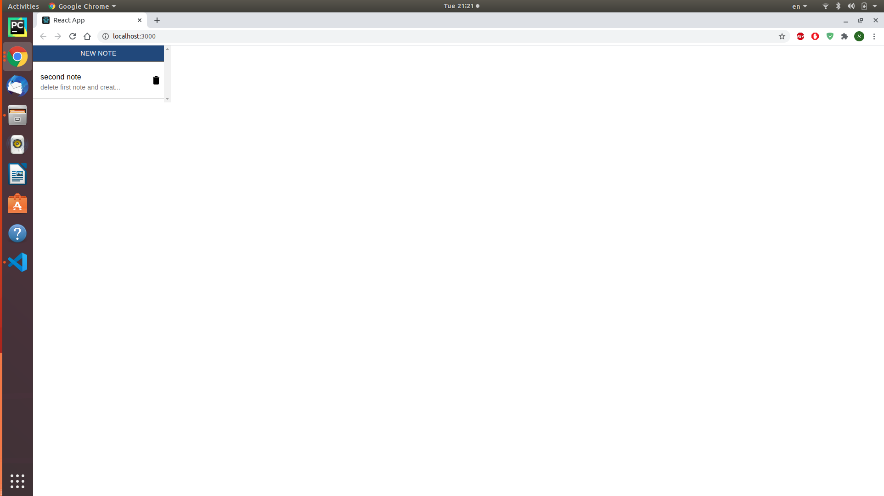

# React Notes App

### This project was bootstrapped with [Create React App](https://github.com/facebookincubator/create-react-app),
### and written with [JavaScript language](https://www.javascript.com/).

A react web app that showes and save the user notes, using firebase database.
The user can add, delete, and edit hes notes from the app.

   
   
   
   
